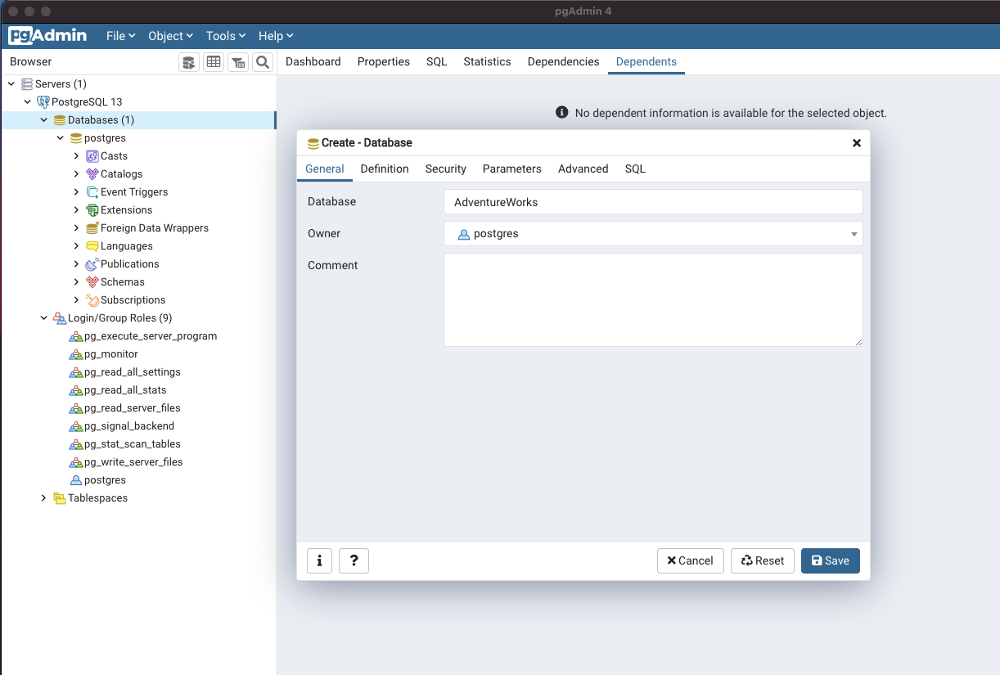

# Restoring AdventureWorks

## With PGAdmin

If you ARE NOT familiar with the command line, this will be the easier option. If you ARE familiar with the command line, this is the slower and harder option. 

### 1. Connect to the Server

First, open PGAdmin and connect to your Postgres server instance by double clicking on the PostgreSQL icon. My version is 13, you might see a different version.


You'll be prompted for a password for the `postgres` user, which you would have set when you installed Postgres through the installation wizard. If you cannot remember this password you may have to reset it. Here are some articles about how to reset it. 

* https://www.postgresqltutorial.com/postgresql-reset-password/
* https://dev.to/theoklitosbam7/how-to-reset-your-forgotten-password-in-postgresql-4a7g

You can also rerun the installation wizard, which will again prompt you to create a password.

### 2. Create Database

Open the Postgres drop down on the left, and hover over `Create` then select `Database...`. Give your database a name (I chose "AdventureWorks") and use the default `postgres` as the owner. Then click save.




### 3. Restore

Right click the database you just created under the `Databases` drop down on the left, and select the `Restore` option. 


In the pop-up window navigate to the file named `adventureworks_backup` in the `data` folder of this repository. Click `Select` then click `Restore`


A window should appear in the bottom right of PGAdmin which indicates the restore job has started. Wait some time and it should look like this:


## Using The Command Line

Navigate to the data directory of this repository, then execute the following two commands:

```
createdb -U postgres AdventureWorks
pg_restore -U postgres --dbname=AdventureWorks adventureworks_backup
```


